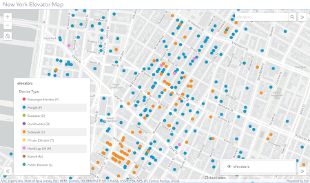

# Interactive Legend

Interactive Legend is a configurable app template where the core functionality revolves around an interactive filter tool. This configurable app template provides end-users with an experience to filter features on a web map via selectable legend elements. 

## Features

Select from two different filter modes:

1. Feature Filter: Layer data features that fall within the criteria of the selected legend elements will display on the map view.
2. Mute: Opacity and gray scale will be applied to layer data features that do not fall within the criteria of the selected legend elements.

       a. Both opacity and gray scale values are configurable

Select from a set of map tools: 
- Home
- Zoom
- Layer List
- Screenshot
- Basemap Toggle
- Search
- Help - panel consisting of preset introductory information
- Splash
- Custom Header

## Instructions

1. Fork and then clone the repo.
2. Run `npm install`
3. Host on local web server.
4. Open web browser.
5. Click on dist directory within browser tab.
6. Test with different web maps.

## Requirements

- Notepad or your favorite HTML editor
- Web browser with access to the Internet

## Resources

- [ArcGIS for JavaScript API Resource Center](http://help.arcgis.com/en/webapi/javascript/arcgis/index.html)
- [ArcGIS Blog](http://blogs.esri.com/esri/arcgis/)
- [twitter@esri](http://twitter.com/esri)

## Issues

Find a bug or want to request a new feature? Please let us know by submitting an issue.

## Contributing

Esri welcomes contributions from anyone and everyone. Please see our [guidelines for contributing](https://github.com/esri/contributing).

## Licensing

Copyright 2019 Esri

Licensed under the Apache License, Version 2.0 (the "License");
you may not use this file except in compliance with the License.
You may obtain a copy of the License at

http://www.apache.org/licenses/LICENSE-2.0

Unless required by applicable law or agreed to in writing, software
distributed under the License is distributed on an "AS IS" BASIS,
WITHOUT WARRANTIES OR CONDITIONS OF ANY KIND, either express or implied.
See the License for the specific language governing permissions and
limitations under the License.

A copy of the license is available in the repository's [license.txt](License.txt) file.
